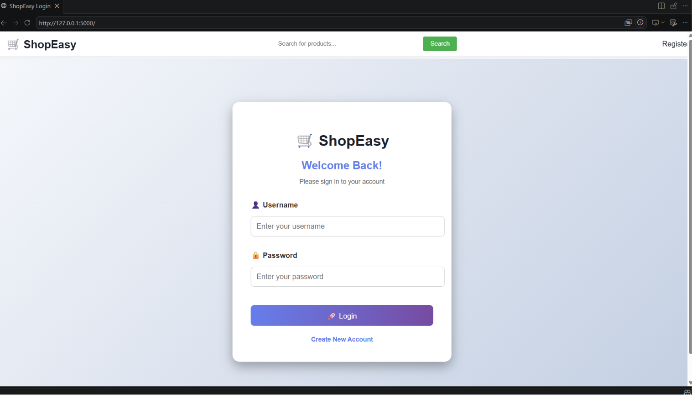
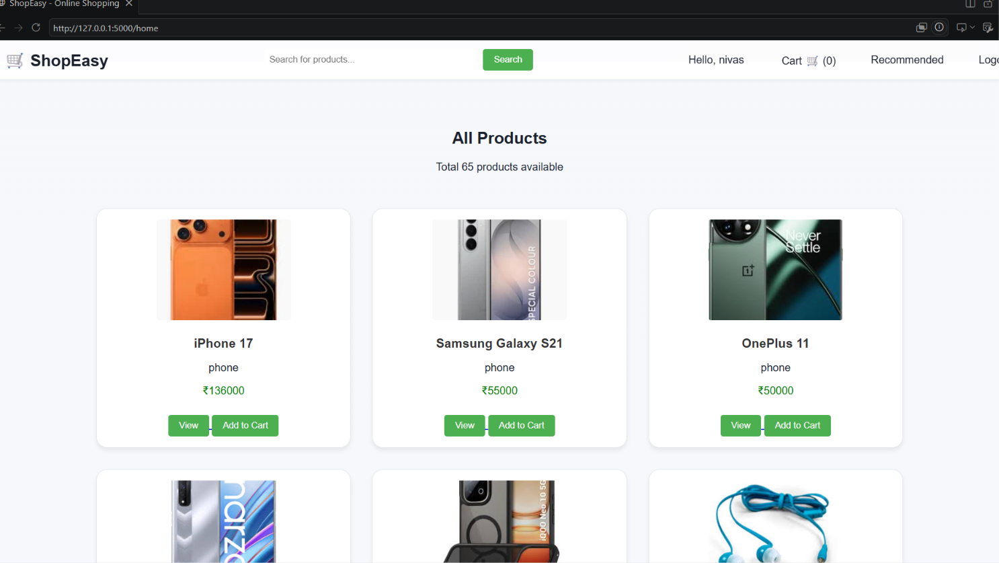

# Ecommerce Product Recommendation System

A Flask-based web application that recommends products based on user recent interaction history using hybrid recommendation algorithms.

## Project Structure

```
ecommerce_recommendation/
├── app/
│   ├── __init__.py          # Flask app factory
│   ├── models/
│   │   ├── __init__.py
│   │   └── database.py      # Database connection and initialization
│   └── routes/
│       ├── __init__.py
│       ├── auth.py          # Authentication routes (login, register, logout)
│       ├── main.py          # Main app routes (home, cart, checkout)
│       └── recommendations.py # Recommendation routes
├── recommendation_engines/
│   ├── __init__.py
│   ├── content_based.py     # Content-based filtering
│   ├── ml_model.py          # Machine learning model
│   ├── hybrid_model.py      # Hybrid recommendation system
│   └── model.py             # Additional ML model
├── data/
│   ├── products.csv         # Product catalog
│   ├── interactions.csv     # User interaction data
│   └── ratings.csv          # User ratings
├── static/
│   ├── style.css            # CSS styles
│   └── images/              # Product images
├── templates/               # HTML templates
│   ├── home.html
│   ├── login.html
│   ├── register.html
│   ├── cart.html
│   ├── checkout.html
│   ├── recommend.html
│   └── order_success.html
├── run.py                   # Application entry point
└── database.db              # SQLite database
```

## Features

- User authentication (login/register)
- Product browsing with search
- Shopping cart functionality
- Product recommendations based on:
  - User recent interaction history
  - Content-based similarity
  - Hybrid approaches
- Responsive UI with fixed navbar

## Installation

1. Clone the repository
2. Install dependencies: `pip install flask pandas scikit-learn`
3. Run the application: `python run.py`
4. Open http://127.0.0.1:5000 in your browser

## Recommendation Algorithm

The system uses a hybrid recommendation approach that combines:
- **Content-based filtering**: Recommends similar products based on product features
- **Collaborative filtering**: Uses user interaction history
- **Recent history**: Prioritizes recently interacted products for personalized recommendations

## Database Schema

- `users`: User accounts
- `interactions`: User-product interactions (views, adds to cart, purchases)

The app will automatically create or migrate the database schema when it starts. If
you make manual changes to the schema while the app is running, you can remove
`database.db` and restart the server to rebuild it from scratch.
## Screenshots

### Login Page


### Home Page


### Recommendations


## Tech Stack

- Python
- Flask
- SQLite
- Pandas
- Scikit-Learn
- HTML
- CSS
- Machine Learning

## Future Enhancements

- Deep Learning Recommendations
- User Wishlist
- Admin Dashboard
- Product Reviews
- Real-time Recommendation Engine

## Author

**Shanaboina Nivas**  
B.Tech CSE (AI & ML)  
St. Martin's Engineering College
